# 📩 Automated Image Resizing and Transfer System Using AWS Services

## 📌 Project Description
✅ **Automated Image Processing System** : The project develops an automated solution for image processing and management within AWS.  
✅ **Efficient Image Handling** : It automatically resizes images and transfers them to a designated storage location.  
✅ **Real-Time Notifications** : Stakeholders receive instant updates on image processing and transfers.  
✅ **AWS Service Integration** : Utilizes AWS Lambda, S3, and SNS to orchestrate the workflow.

## ✨ Key Features
💡   **Image Processing Automation** – Automatically resize and optimize images upon upload.  
🔒 **Secure Storage** – Store processed images in a secure and reliable **S3 bucket**.  
📩 **Real-time Notifications** – Receive instant updates about image processing via **SNS**.  
📈 **Scalable Architecture** – Designed to handle high image processing demands.  
💰 **Cost-efficient Solution** – Leverages **AWS serverless technologies** to minimize operational costs.  

## 📊 Overview
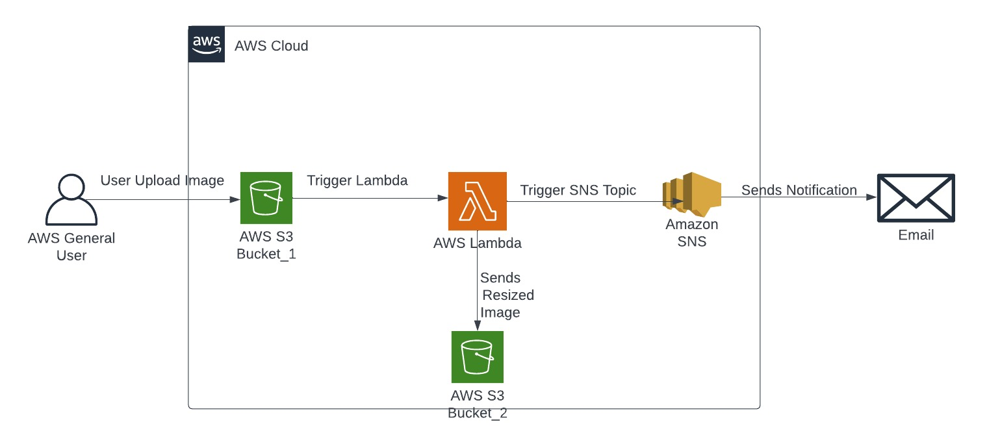

---
### **🎥 Live Demo**
1. Uploaded image to **source-image-bucket**.
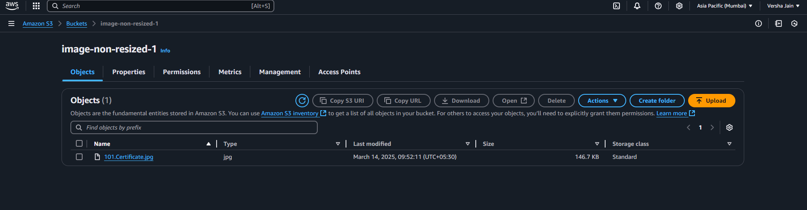
2. Checked **destination-resized-bucket** for the resized image.
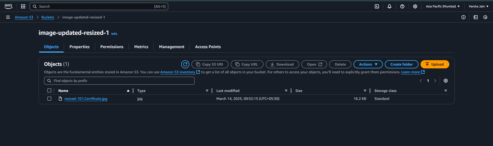
3. Verifed **SNS notification** for the processed image.
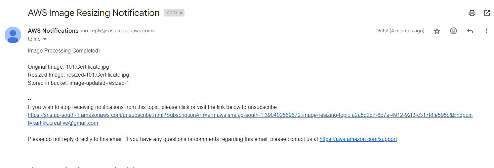

---

## 🔍 Implementation Workflow

### **1️⃣ Automated Image Processing Workflow**
1. User uploads an image to an **S3 Source Bucket**.
2. **AWS S3 triggers Lambda** upon new uploads.
3. **Lambda processes and resizes** the image using **PIL (Python Imaging Library)**.
4. Resized images are stored in the **Destination S3 Bucket**.
5. **CloudWatch Logs** capture execution details.

### **2️⃣ AWS Lambda with Python Implementation**
- Utilized **boto3** for S3 interactions.
- Implemented **image resizing** (default: 300x300 pixels).
- Optimized image storage with **BytesIO buffer**.

### **3️⃣ Secure & Scalable AWS Infrastructure**
- Configured **IAM roles** for Lambda execution.
- Enabled **SNS notifications** for error handling.
- Implemented **CloudWatch logging & monitoring**.

---

## 🛠 Step-by-Step Setup

### **🔗 Step 1: Create Two S3 Buckets**
1. Go to **AWS S3 Console**.
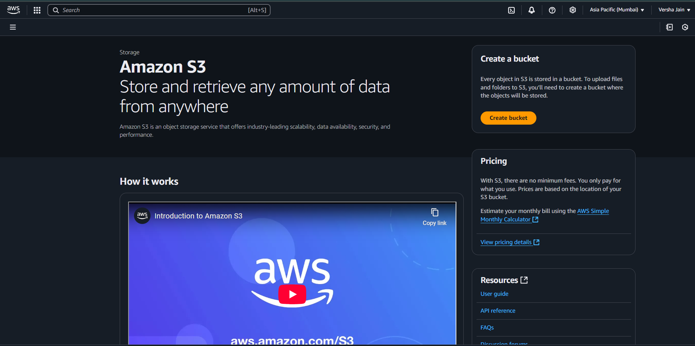
2. Create a **Source Bucket** (e.g., `source-image-bucket`).
3. Create a **Destination Bucket** (e.g., `destination-resized-bucket`).
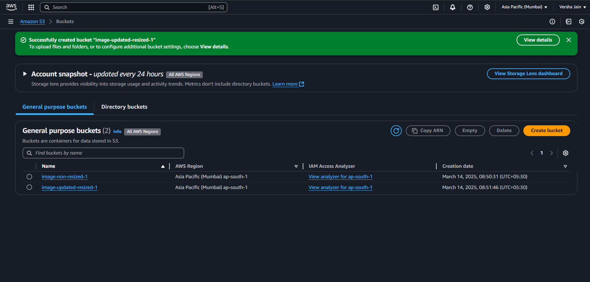
4. Modify public access settings if required.


### **🔗 Step 2: Create an SNS Topic and Subscription**
1. Navigate to the **SNS Console**.
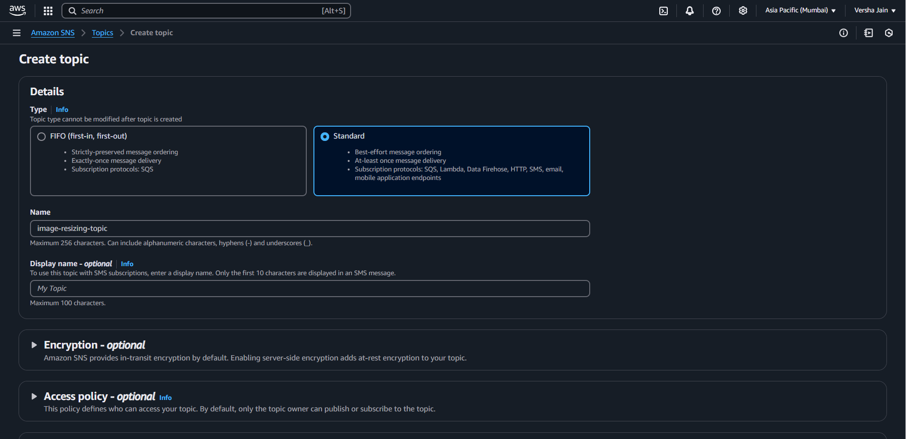
2. Create a new **SNS Topic** (e.g., `image-processing-topic`).
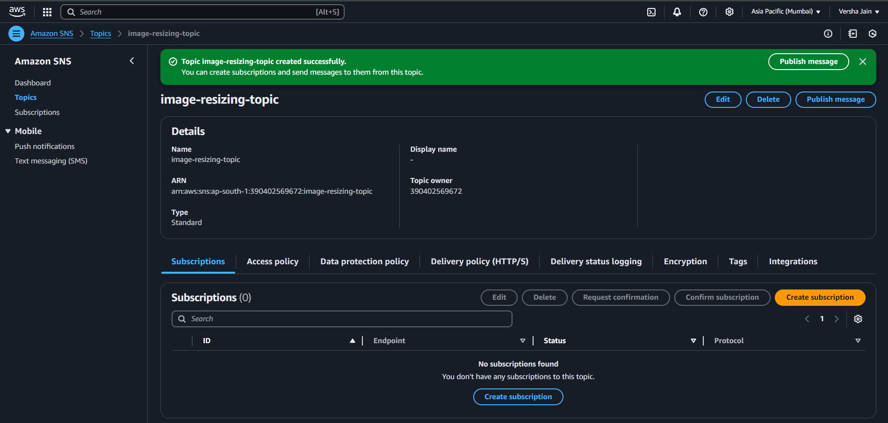
3. Add a **Subscription** to the topic (choose email or Lambda as an endpoint).
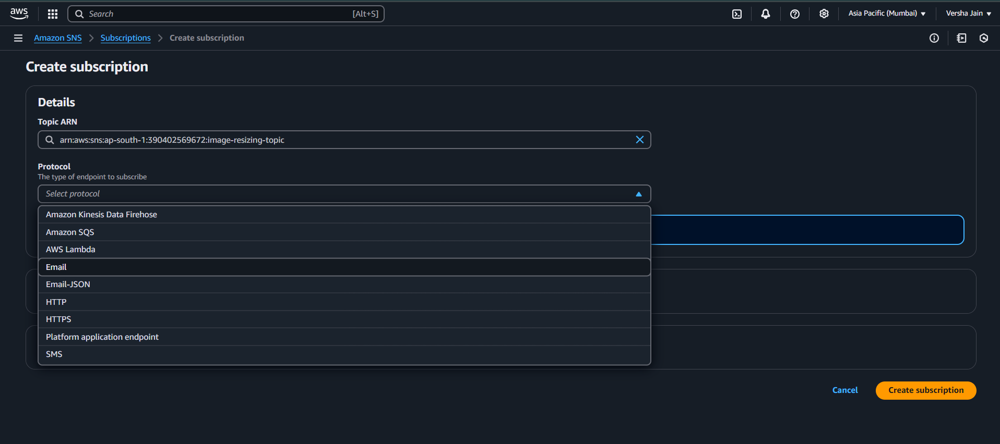
4. Confirm the subscription status via email for notifications.
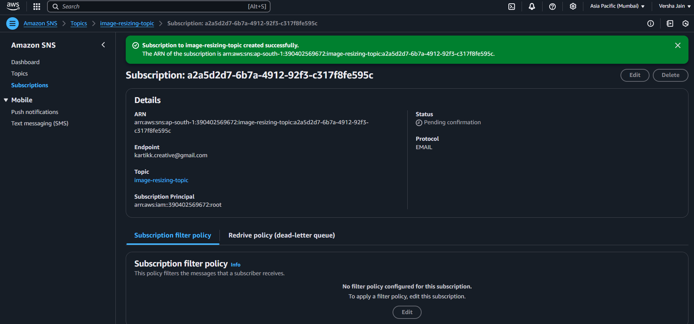

### **🔗 Step 3: Configure AWS Lambda Function**
1. Go to **AWS Lambda Console**.
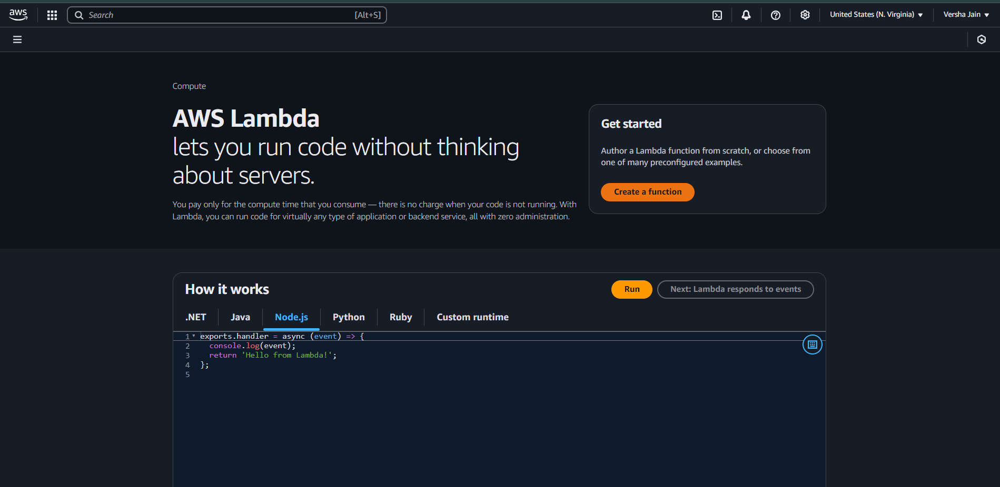
2. Click **Create Function** > **Author from Scratch**.
3. Name it **resize-image-function**.
4. Choose **Python 3.x** as the runtime.
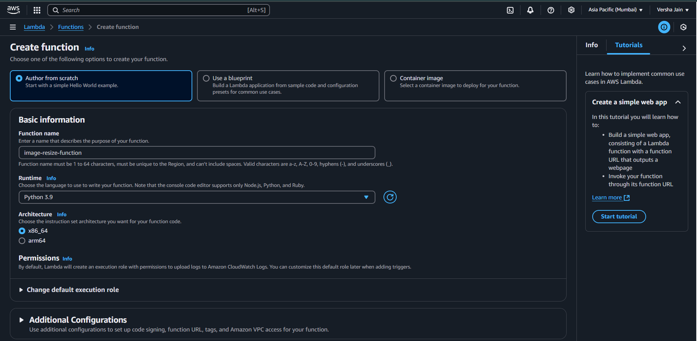
5. Set up an execution role with **S3, SNS, and CloudWatch permissions**.

### **🔗 Step 4: Configure IAM Roles with Required Permissions**
1. Go to the **IAM Console**.
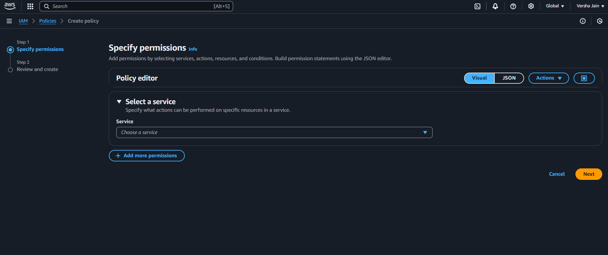
2. Create a new **IAM Role**.
3. Attach the following permissions:
   - Full access to **S3**.
   - Invoke **Lambda**.
   - Publish to **SNS**.
   - Log execution in **CloudWatch**.
4. Result of Attached permissions:
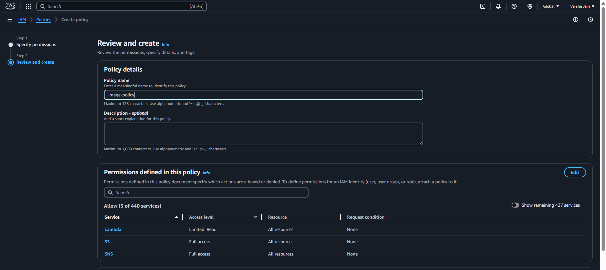   

### **🔗 Step 5: Attach IAM Policy to Lambda Function**
1. Create an IAM policy with the required permissions.
2. Attach it to the Lambda function’s execution role.
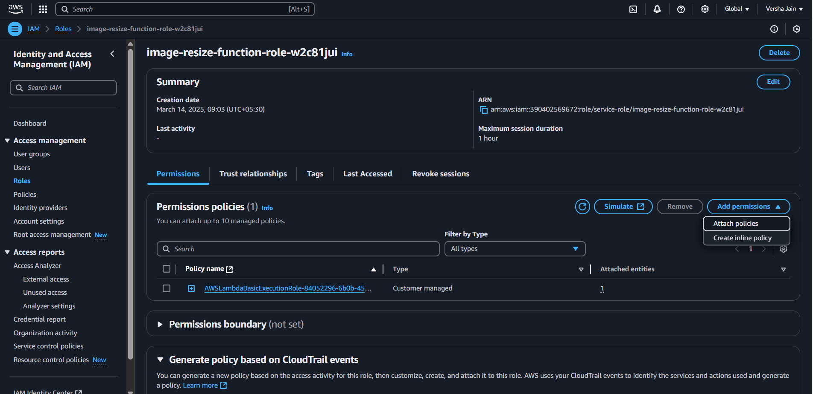

### **🔗 Step 6: Configure Lambda Environment Variables**
- `SOURCE_BUCKET`: `source-image-bucket`
- `DESTINATION_BUCKET`: `destination-resized-bucket`
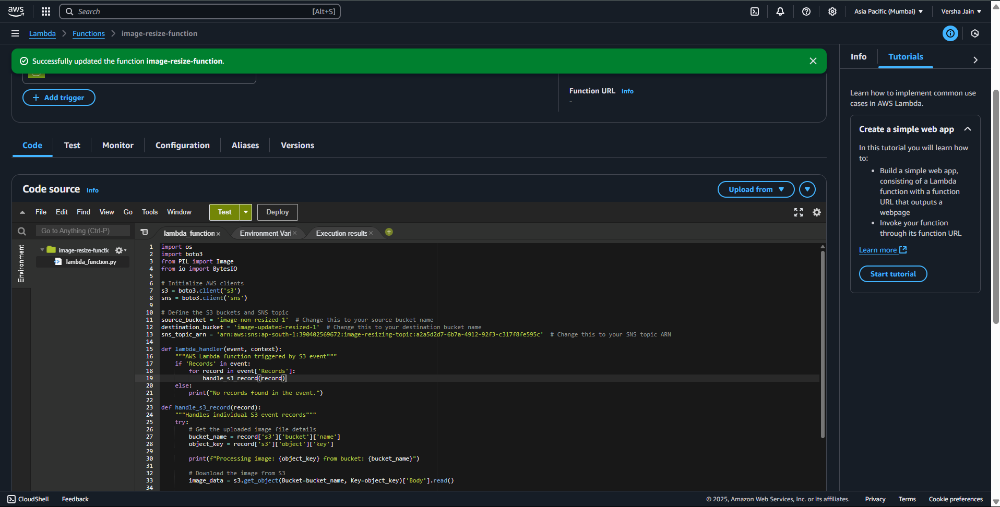

### **🔗 Step 7: Add S3 Trigger to Lambda**
1. Go to **Lambda Console**.
2. Navigate to **Configuration > Triggers**.
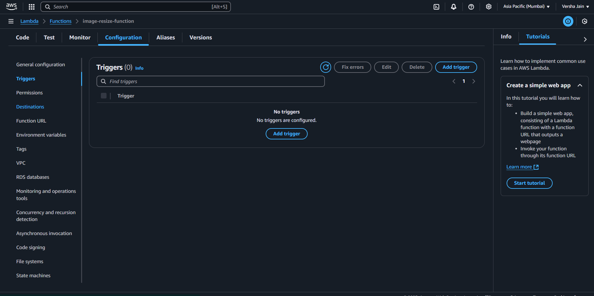
3. Add **S3 Trigger** for `source-image-bucket`.
4. Set **event type** to **PUT (Object Created)**.
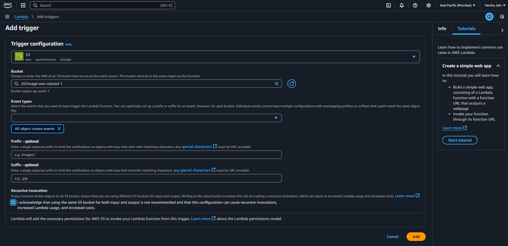

### **🔗 Step 8: Deploy and Test Python Code in Lambda**
1. Open the **Lambda Code Editor**.
2. Paste the script from `lambda_function.py`.
3. Click **Deploy**.
4. Run a **Test Event** to verify execution.
5. Retrieve the updated code from `lambda_function.py` for execution.


### **🔗 Step 9: Add a Layer in Lambda**
1. Go to the **Lambda Console**.
2. Select **Layers** under the **Code** section.
3. Click **Add Layer**.
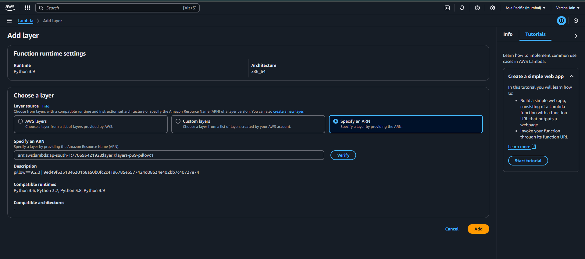

### **🔗 Step 10: Enter the ARN for the required dependencies (e.g., PIL library layer ARN)**

```
arn:aws:lambda:ap-south-1:770693421928:layer:Klayers-p39-pillow:1
```

### **🔗 Step 11: Upload an Image and Verify**
1. Upload an image to **source-image-bucket**.

2. Check **destination-resized-bucket** for the resized image.

3. Verifed **SNS notification** for the processed image.


---

## 🎯 Expected Outcomes
✅ Fully automated **image resizing system** in AWS.  
✅ Hands-on experience in **Lambda, S3, IAM, SNS, and CloudWatch**.  
✅ Secure and scalable AWS architecture.  
✅ Efficient image processing with **PIL and S3 storage**.  

## 📢 Let's Connect!
- 🔗 Stay updated on [LinkedIn](https://www.linkedin.com/in/-kartikjain/) for more DevOps projects and insights.
- 🎯 Follow along as I explore **Cloud Infrastructure, Ansible Automation, and DevOps practices**.
- 🤝 Let's collaborate and build scalable solutions together!!

